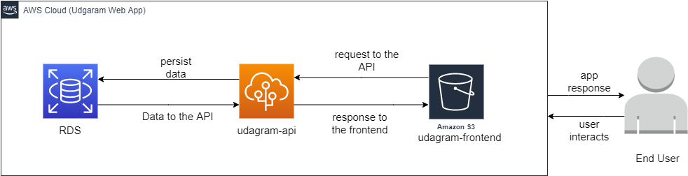
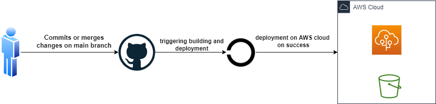

# AWS - CI/CD
This project is an project that's aimed to learn  about aws services that helps in deployment such as elastic beanstalk, RDS, S3.
In addition to automating the CI/CD process using CircleCi.


## Project setup

1. Make sure to add this project into your circleci
2. Add the following env variables to your circleci project:
    ```
    AWS_ACCESS_KEY_ID	
    AWS_DEFAULT_REGION	
    AWS_SECRET_ACCESS_KEY	
    ```
3. After that make sure to create ElasticBeanstalk (EB) app with nodejs as a plateform
4. Create `udagram/udagram-api/.elasticbeanstalk/config.yml` to autoconfigure your EB and add its proper values
ie (platform, application name, environment name, etc..)
5. After that you will need to create RDS and pass the desired Database information as env variables to your CircleCi in the following path : Project Setting > Environment Variables.
   Below are the Env variables you need to add in circle ci
    ```
    AWS_BUCKET
    AWS_PROFILE
    AWS_REGION
    JWT_SECRET
    PORT
    DB_PORT
    POSTGRES_DB
    POSTGRES_HOST
    POSTGRES_PASSWORD
    POSTGRES_USERNAME
    URL
    ```
6. In order to serve the Frontend you will need to create s3 bucket that's readable
7. After creating the bucket, update `YOUR-BUCKET-NAME` with the new bucket name in this file (`udagram/udagram-frontend/bin/deploy.sh`)  
    ```
    aws s3 cp --recursive --acl public-read ./build s3://YOUR-BUCKET-NAME

    ```

### To access the Frontend App
```
http://udagram-fronted.s3-website-us-east-1.amazonaws.com
```

### To access the Backend API
```
http://udagramwebapi-env.eba-8u5xfa9g.us-east-1.elasticbeanstalk.com/
```
## Project architecture



## Pipeline overview

